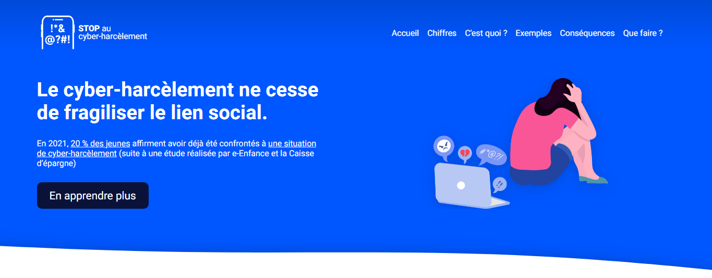

# STOP au cyber-harcèlement

[STOP au cyber-harcèlement](https://www.stop-au-cyberharcelement.live/) is a website we made for a school project.
It's intended for a french public.



The website was built with [Next.js](https://nextjs.org/) but we had some hard time with their image system (so most of the time, we used vanilla img). It is deployed on Vercel. Any contributions are welcome. For now, the code needs a lot of refactoring because the file of the home page is 1400 lines long (it's way too many). 

## Getting Started

To run the development server:
```bash
npm run dev
# or
yarn dev
```
And next open http://localhost:3000

To build the project:
```bash
npm run build
# and to start the server
npm run start
```
